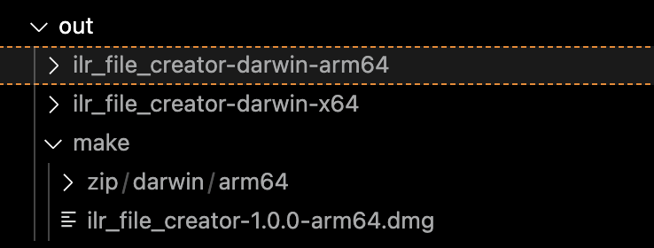

# ILR_File_Creator

## Overview:
The DFE tool for creating XML files that can be uploaded to their website is slow and limited in its function. My organization an Airtable that contains all the information it asks for but its hard to move all that information into the DFE tool. To fix this we built a new ILR tool that takes the CSV values generated from our Airtable and processes them to a XML file automatically. If you want to create a similar Airtable or Excell document that can be fed into this tool a guide is at the bottom fo this document.

## User Stories

* User can upload a cvs file to application
* App will tell user if there are any empty or missing fields in the CSV list
* App will return a XML file to the user thats structure matches that required by the DFE


## Usage
This repo can be used to update and create copies of the ILR tool app. Bellow I will give general instructions for making creating copies of the app and how to update the tool when the ILR produces new versions. (note I can not account for everything they might change in a version and future users may need to update the code to account for changes made in a new academic year) Finally I will provide instructions for how to use the app and organize your table.

### Set Up

First make sure your computer is set up with a functional terminal as well as npm, GIT, and a code editor like VS code. A guide for creating this set up can be found [here](https://foundersandcoders.notion.site/Installation-Guide-6fdc64ecf0ea4e6f8773075b02752c22).

From there open a terminal and navigate to where you would like the repo to go on your computer. The first 4 steps of [this command line guide](https://medium.com/swlh/how-to-use-the-command-line-interface-cli-9c8b70e568e) will help if you are not familiar with using your terminal.

Once you are in the right area, use the following commands to download open and set up the project

```bash
# Download Project
git clone https://github.com/foundersandcoders/ILR_File_Creator.git

# Navigate to the project directory
cd ILR_File_Creator

# Install dependencies
npm install
```

From here you are ready to make your copies of the app which you can use or share. the following commands will create a version of the app for whatever operating system you use.

```bash
# Packages app
npm run package

# Builds app
npm run make
```
After running these commands you should see something like in your code editor 


The app will appear within the make folder which is inside the out folder. In this photo I am making a mac os version so we have a Darwin zip file and a .dmg file but the exact outputs will vary depending on your computer. You can left click to open these in your finder and then copy them to wherever you want to use them from.

### Updating With ILR Tool
When the academic year changes and the official ILR application is updated along with the schema you will need to make at lease two adjustments to this project. 

First go on the DFE website and find the schema for the current academic years XMLS. They can usually be found somewhere within [this part](https://guidance.submit-learner-data.service.gov.uk/) of the DFE website. Once you find the schema copy its content and use it to replace the content of schemafile.xsd, which is the 2024-25 version of the schema.

2nd, download the official version of the ILR application on a windows computer. Left click on it and look at the application information to find the version it should be something like 2425.1.49.0 (note there is a shorter version of this version code displayed in application when you open it you want the long version) Keep this version code on hand since the ILR tool will require it to be input along with the CVS.

### Application Usage 
When you open the application it asks for the version code discussed above and a CSV (more details bellow). Once these are supplied the tool will display error messages and warnings. Warnings are fine and one or two are usually produced but if there are errors you wont be able to upload to the DFE's website until they are resolved. (you will get the line in the XML where there error is to help find it) You can click a button to download this XML file to your computer and then upload it to the DFE website. I want to end this by saying how to organize your table so it produces the correct CSV files. The columns should be as follows in the exact order. If you dont have information for a row leave it blank do not put in place holder values.

Record,Previous UKPRN,ULN,Given name,Family name,Sex ,Date of birth,NI number,Ethnic group,Prior post code,Post code,Street address ,Telephone number,Primary additional needs,Prior attainment date applies to,Prior attainment,Learning hours (skills bootcamp),Employment #1 date applies to,Employment status #1,Employer identifier #1 ,Small employer #1,Is the learner self employed? #1,Has the learner been made redundant? #1,Length of employment #1,Employment intensity indicator #1,Length of unemployment #1,Employment #2 date applies to,Employment status #2,Employer identifier #2,Employment intensity indicator #2,Has the learner been made redundant? #2,Is the learner self employed? #2,Small employer #2 ,Length of employment #2,Aim type (programme aim 1),Programme aim 1 Learning ref ,Start date (aim 1),Planned end date (aim 1),Funding module (aim 1),Programme type (aim 1),Apprentice standard (aim 1),Delivery postcode (aim 1),Planned hours (aim 1),Actual hours (aim 1),Contract Ref (aim 1),EPAO ID (aim 1),Contract type (aim 1),Contract type code (aim 1),Date applies from (aim1),Date applies to (aim 1),Funding indicator (aim 1),Source of funding (aim 1),Financial type 1 (aim 1),Financial code 1 (aim 1),Financial start date 1 (aim 1),Training price (aim 1),Financial type 2 (aim 1),Financial code 2 (aim 1),Financial start date 2 (aim 1),Total assessment price (aim 1),Completion status (aim 1),Actual end date (aim 1),Achievement date (aim 1),Outcome (aim 1),Withdrawal reason (aim 1),Outcome grade (aim 1),Aim type (programme aim 2),Programme aim 2 Learning ref ,Start date (aim 2),Planned end date (aim 2),Funding module (aim 2),Programme type (aim 2),Apprentice standard (aim 2),Delivery postcode (aim 2),Planned hours (aim2),Actual hours (aim 2),Contract ref (aim 2),EPAO ID (aim 2),Contract type (aim 2),Contract type code (aim 2),Date applies from (aim 2),Date applies to (aim 2),Funding indicator (aim 2),Source of funding (aim 2),Financial type 1 (aim 2),Financial code 1 (aim 2),Financial start date 1 (aim 2),Training price (aim 2),Financial type 2 (aim 2),Financial code 2 (aim 2),Financial start date 2 (aim 2),Total assessment price (aim 2),Completion status (aim 2),Actual end date (aim 2),Achievement date (aim 2),Outcome (aim 2),Withdrawal reason (aim 2),Outcome grade (aim 2),Aim type (programme aim 3),Programme aim 3 learning ref ,Start date (aim 3),Planned end date (aim 3),Funding module (aim 3),Programme type (aim 3),Apprentice standard (aim 3),Delivery postcode (aim 3),Planned hours (aim 3),Actual hours (aim 3),Contract ref (aim 3),EPAO ID (aim 3),Contract type (aim 3),Contract type code (aim 3),Date applies from (aim 3),Date applies to (aim 3),Funding indicator (aim 3),Source of funding (aim 3),Financial type 1 (aim 3),Financial code 1 (aim 3),Financial start date 1 (aim 3),Training price (aim 3),Financial type 2 (aim 3),Financial code 2 (aim 3),Financial start date 2 (aim 3),Total assessment price (aim 3),Completion status (aim 3),Actual end date (aim 3),Achievement date (aim 3),Withdrawal reason (aim 3),Outcome (aim 3),Outcome grade (aim 3),Aim type (programme aim 4),Programme aim 4 learning ref,Start date (aim 4),Planned end date (aim 4),Funding module (aim 4),Programme type (aim 4),Apprentice standard (aim 4),Delivery postcode (aim 4),Planned hours (aim 4),Actual hours (aim 4),Contract ref (aim 4),EPAO ID (aim 4),Contract type (aim 4),Contract type code (aim 4),Date applies from (aim 4),Date applies to (aim 4),Funding indicator (aim 4),Source of funding (aim 4),Financial type 1 (aim 4),Financial code 1 (aim 4),Financial start date 1 (aim 4),Training price (aim 4),Financial type 2 (aim 4),Financial code 2 (aim 4),Financial start date 2 (aim 4),Total assessment price (aim 4),Completion status (aim 4),Actual end date (aim 4),Achievement date (aim 4),Withdrawal reason (aim 4),Outcome (aim 4),Outcome grade (aim 4),Aim type (programme aim 5),Programme aim 5 learning ref ,Start date (aim 5),Planned end date (aim 5),Funding module (aim 5),Programme type (aim 5),Apprentice standard (aim 5),Delivery postcode (aim 5),Planned hours (aim 5),Actual hours (aim 5),Contract ref (aim 5),EPAO ID (aim 5),Contract type (aim 5),Contract type code (aim 5),Date applies from (aim 5),Date applies to (aim 5),Funding indicator (aim 5),Source of funding (aim 5),Financial type 1 (aim 5),Financial code 1 (aim 5),Financial start date 1 (aim 5),Training price (aim 5),Financial type 2 (aim 5),Financial code 2 (aim 5),Financial start date 2 (aim 5),Total assessment price (aim 5),Completion status (aim 5),Actual end date (aim 5),Achievement date (aim 5),Outcome (aim 5),Withdrawal reason (aim 5),Outcome grade (aim 5)
